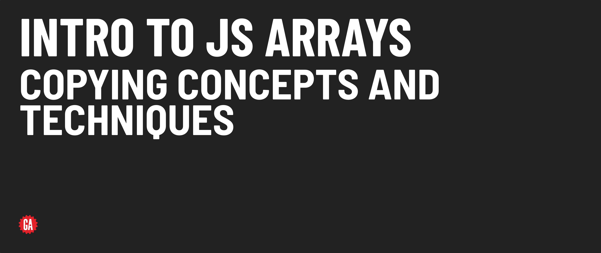

# Intro to JS Arrays - Copying Concepts and Techniques



**Learning objective:** By the end of this lesson, students will be able to make partial or full copies of an array.

When working with arrays in JavaScript, there are scenarios where you will want to create a copy of an array rather than modifying the original one. This can prevent unintended side effects in your code, or you might want to derive a new list from the original without affecting the original.

There are multiple methods to copy an array. The method you choose will largely depend upon whether you wish to copy a segment of the array or the entire array itself.

## Copy all of an array

The [Spread syntax](https://developer.mozilla.org/en-US/docs/Web/JavaScript/Reference/Operators/Spread_syntax) `...` is a concise way to duplicate an entire array:

Example:

```js
// as a reminder, movies is ['Barbie', 'Get Out', 'John Wick']

const moviesCopy = [...movies];
// movies copy is ['Barbie', 'Get Out', 'John Wick']
```
All elements from the `movies` array have been copied into the new array.

## Copy some of an array

The [`slice()`](https://developer.mozilla.org/en-US/docs/Web/JavaScript/Reference/Global_Objects/Array/slice) method comes in handy if you want to copy just a portion of an array. This method always returns a new array and, more importantly, doesn't modify or *mutate* the source array.

___
:books: *Mutating* means directly changing a piece of data without making a separate copy. So, if you change it in one place, it changes everywhere else you're using it too.
___

The syntax for `slice()` is as follows:

```js
slice()
slice(start)
slice(start, end)
```

Here, the second argument is the ending index but does not include the value at that index in the result.

Example:

```js
// movies is ['Barbie', 'Get Out', 'John Wick']
const twoMovies = movies.slice(1);
// twoMovies is ['Get Out', 'John Wick']
```

## Copy an array and insert additional elements

Here's how you can copy an array and insert additional elements simultaneously using the spread syntax:

```js
const moreMovies = ['The Matrix', ...movies];
// moreMovies is ['The Matrix', 'Barbie', 'Get Out', 'John Wick']
```
