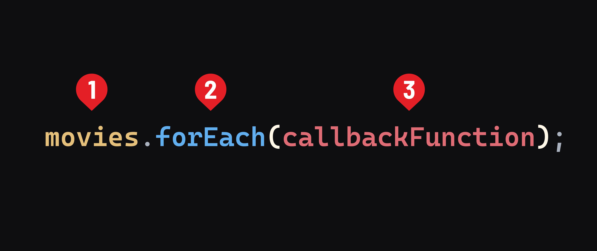

# 

**Learning objective:** By the end of this lesson, students will be able to utilize the `forEach()` method to execute a function on each item in an array.

## Introducing the `forEach()` iterator method

The [`forEach()`](https://developer.mozilla.org/en-US/docs/Web/JavaScript/Reference/Global_Objects/Array/forEach) method is another declarative approach that provides a more readable way to iterate over ***all*** array elements. This method clearly communicates a developer's intention to process each item and perform an action on each.

### Functions as arguments

Before we dive into `forEach()`, let's talk about a very cool feature of JavaScript. It treats functions as *first-class citizens*, meaning they operate like any other piece of data so they can be used as arguments.

> 📚 Entities such as functions in JavaScript that can be assigned to a variable, passed as an argument to a function, returned from a function, and stored in arrays or objects are known as *first-class citizens*.

### Anonymous functions

When functions are used this way, they also don't need a name. These unnamed functions are called *anonymous functions*. These look and behave like other functions; they just don't have a name. This is great for one-time tasks where we don't intend to call the function again.

> 📚 An *anonymous function* is a function without a name. Unlike named functions, you can't refer to anonymous functions later in your code, making them useful for one-time operations.

## Syntax

This is the most basic syntax for using the `forEach()` method on the `movies` array:



1) The array that we will iterate through, in this case, `movies`.
2) The `forEach()` method. This method always returns `undefined`, no matter what code is inside the callback function.
3) The *callback function* is where we will write the function that will be executed for each item in the `movies` array.

> 📚 A *callback function* is a function passed into another function as an argument. 

We'll start with the simplest callback function we can:

```js
// as a reminder, movies is ['Barbie', 'Arrival', 'Get Out', 'Coco']

movies.forEach((movie) => {
  console.log(movie)
});
```

> 🏆 It's recommended to name the first parameter (representing each item) as a singular form of the array's name. So, if your array is named `movies`, name the parameter `movie`.

Remember this callback function runs for each item in the `movies` array. `movie` is an individual element in the `movies` array. So in the first iteration `movie` will be `'Barbie'`. In the second, it will be `'Arrival'`, and so on.

This code will result in the following output:

```text
Barbie
Arrival
Get Out
Coco
```

In addition to the current element, `forEach()` also provides the index of the current element to the callback function:

```js
movies.forEach((movie, index) => {
  if(index === 2) console.log("This is the third movie:");
  console.log(movie);
});
```

Which will result in the following output:

```
Barbie
Arrival
This is the third movie:
Get Out
Coco
```

> 🚀 Check out the [Expanding on `forEach()` Level Up](../level-up/expanding-on-forEach.md) for more examples of using this method.
