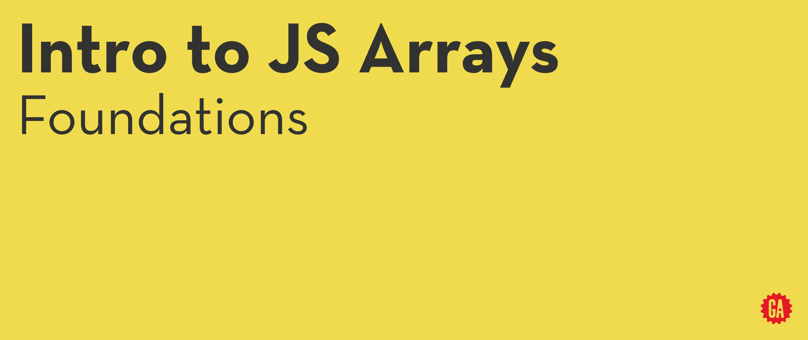

# Intro to JS Arrays - Foundations



**Learning Objective:**
By the end of this lesson, students will be able to create arrays and access elements within arrays using square bracket notation `[]` and the `array.at()` method.

## Creating Arrays

There are two primary methods for initializing arrays:

1. **Array Literal Notation (Recommended)**
  
   Using Array Literal Notation is the preferred way to create arrays. It involves defining an array using square brackets and listing its elements.

   ```js
   const nums1 = [2, 4, 18];
   ```

2. **Array Class (Less Common)**
   
   The Array class can also be used to create arrays, although it's less commonly used. It requires passing elements as arguments.

   ```js
   const nums2 = new Array(2, 4, 18);
   ```

The best practice is to use _Array Literal Notation_ because it's more concise and the class approach behaves differently if you pass only one argument.


### :wave:  Hands-On : 1 min

Create an array named `movies` containing the titles (strings) of three of your favorite movies.


## Accessing Elements in an Array

Array elements are accessed using square bracket notation along with the element's __index__ (position) within the array.

```js
let movies = ['Caddyshack', 'Interstellar', 'Moonraker'];

// Accessing the first movie ('Caddyshack')
let firstMovie = movies[0];
```

Note that indexes are integers where `0` is used to access the first element.

<hr>

:books:  An __index__ is a numerical value that represents the position of an element within an array.

<hr>

🧠  Remember that array indexes start from 0 for the first element. This "zero-based" indexing convention is used in programming to align with memory offset principles.

<hr>


### Accessing the Last Element

To access the last element of an array, you can utilize the [length](https://developer.mozilla.org/en-US/docs/Web/JavaScript/Reference/Global_Objects/Array/length) property.

```js
// Accessing the last movie ('Moonraker')
let lastMovie = movies[movies.length - 1];
```

Keep in mind that JavaScript does not support negative indexing, unlike some other programming languages. Attempting to access an array element with a negative index will result in `undefined`.

```js
movies[-1];  // Returns: undefined
```

### Using the array.at() Method

Starting from ES6, JavaScript introduced the array.at() method to directly access elements by their index, providing a concise alternative to traditional bracket notation.

You can even use negative indexes when you use the .at() method.

```js
let secondMovie = movies.at(-2);  // Accessing the second movie ('Interstellar')
```

The array.at() method improves code readability, especially when working with complex array manipulations.