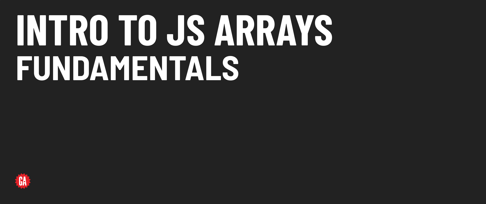

# Intro to JS Arrays - Fundamentals



**Learning objective:** By the end of this lesson, students will be able to create arrays and access elements within arrays using square bracket notation `[]` and the `array.at()` method.

## Creating arrays

There are two primary methods for initializing arrays:

1. **Array literal notation (recommended)**
  
   Using array literal notation is the preferred way to create arrays. It involves defining an array using square brackets and listing its elements.

   ```js
   const numsLiteral = [2, 4, 18];
   ```

2. **Array class (less common)**
   
   Although it's less commonly used, the `Array` class can also create arrays. It requires passing elements as arguments.

   ```js
   const numsClass = new Array(2, 4, 18);
   ```

The best practice is to use _array literal notation_ because it's more concise. The class approach also [behaves differently](https://developer.mozilla.org/en-US/docs/Web/JavaScript/Reference/Global_Objects/Array/Array#array_constructor_with_a_single_parameter) if you pass only one argument. 

### :wave: Hands-on: 1 min

Create an array named `movies` containing the titles (as strings) of three of your favorite movies.

## Accessing elements at any position in an array

Array elements are accessed using square bracket notation along with the element's __index__ (position) within the array.

```js
const movies = ['Barbie', 'Interstellar', 'Get Out'];

const firstMovie = movies[0];
// firstMovie is 'Barbie'
```

Note that indexes are integers where `0` is used to access the first element. Each consecutive element has its index incremented by one.

<hr>

:books: An __index__ is a numerical value that represents the position of an element within an array.

<hr>

:brain: Remember that array indexes start from 0 for the first element. This "zero-based" indexing convention is used in programming to align with memory offset principles.

<hr>


## Accessing the last element of an array

You can use a couple of techniques to access the last element in an array - the classic `length` property, or one of the more recent additions to JavaScript - the `at()` method.

### The `length` property

To access the last element of an array, you can utilize the [length](https://developer.mozilla.org/en-US/docs/Web/JavaScript/Reference/Global_Objects/Array/length) property.

```js
const lastMovie = movies[movies.length - 1];
// lastMovie is 'Get Out'
```

Unlike other programming languages, JavaScript does not support negative indexing using this method. Attempting to access an array element with a negative index will result in a value of `undefined`.

```js
movies[-1];  // undefined
```

### The `at()` method

In ES2022, the `at()` method was added to the JavaScript spec. The `at()` method can directly access elements by their index. It's not that different from square bracket notation at first glance, except it does accept negative indexes! This can be used to access the last item in an array easily: 

```js
const lastMovieAt = movies.at(-1);  
// lastMovieAt is 'Get Out'
```

The `.at()` method improves code readability, especially when executing complex array manipulations.
