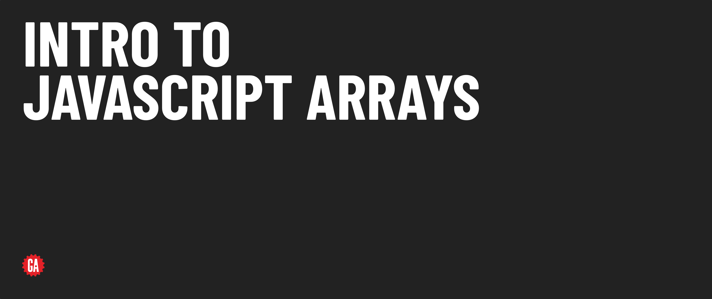

# Intro to JavaScript Arrays - Release Notes

## Version 1.0 - Updates from legacy content

This release modularizes the legacy Intro to JavaScript Arrays lecture and provides some other minor updates detailed below. Updates are provided here at the module level, but all subsequent updates should be documented at the lesson level.

### Release details

**Additions**

- Add content covering the `at()` method
- Add details on shallow copy versus deep copy in level up content 

**Changes**

- Setup is now conducted in VS Code instead of utilizing Replit
- Flesh out array concepts content to provide more detail and draw real-life connections
- Update variable names throughout to be more accurately or clearly named
- Update movie and book data to be more diverse and widely relevant
- Split accessing/updating elements in an array into two ideas to better create a conceptual division between accessing and updating elements
- Update content to be style guide compliant
- Expand on written lecture material to provide a more straightforward outline for instructors to deliver content with and to provide more thorough written documentation for students
- Provide more accurate documentation examples

**Removals**

- Remove level up content covered in other modules 
