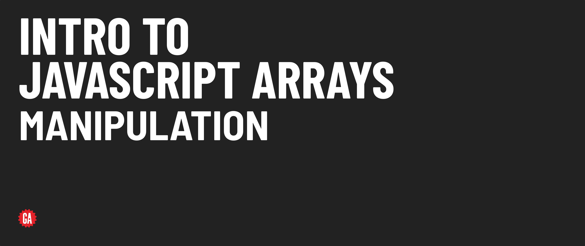

# JS Arrays - Manipulation

**Learning objective:** By the end of this lesson, students will be able to manipulate arrays by modifying their contents and by adding or removing elements anywhere in an array.

## Updating existing elements in an array

Just like we access elements in an array using square bracket notation, we can also use this same syntax to update an element in a specific position:

```js
// recall that movies is ['Barbie', 'Interstellar', 'Get Out']

// let's update the 2nd movie (index of 1)
movies[1] = 'Arrival';
// movies is now ['Barbie', 'Arrival', 'Get Out']
```

Wait though, isn't `movies` a constant? How are we able to modify its contents? 

When we made `movies` a constant, we told JavaScript not to let us change what `movies`  points at (a specific array). It is not, however, saying that the contents of that array cannot be *mutated* or altered. In short, if we try doing something like the examples below, we'll get an error:

```js
// attempting to change the movies constant to a string
movies = 'Barbie and Arrival'
// attempting to change the movies constant to a different array
movies = ['Barbie', 'Arrival']
```

But when we change the contents of the existing array, everything checks out fine!

___
:books: *Mutation* is the modification of the content of a data structure or variable. This contrasts with *immutability*, where data cannot be changed once created.
___

## Adding or removing elements at the start or end of an array

Don't worry; we'll eventually get to adding (and removing) elements anywhere in an array!

### `push()`

We can add one or more elements to the **end** of an array using the [`push()`](https://developer.mozilla.org/en-US/docs/Web/JavaScript/Reference/Global_Objects/Array/push) method:

```js
movies.push('Parasite');
// movies is ['Barbie', 'Arrival', 'Get Out', 'Parasite']
```

To add multiple items, pass more than one argument to the method, as demonstrated below with the `unshift()` method.

### `unshift()`

Just like `push()`, [`unshift()`](https://developer.mozilla.org/en-US/docs/Web/JavaScript/Reference/Global_Objects/Array/unshift) allows us to add one or multiple items to an array, this time at the start of the array.

```js
movies.unshift('Dune', 'Coco');
// movies is ['Dune', 'Coco', 'Barbie', 'Arrival', 'Get Out', 'Parasite']
```

Here, we've added two items to the array by passing multiple arguments to the method.

### `pop()`

We can remove a single element from the **end** of an array using the `pop()` method:

```js
movies.pop();
// movies is ['Dune', 'Coco', 'Barbie', 'Arrival', 'Get Out']
```

### `shift()`

We can also remove from the **front** of an array with `shift()`:

```js
movies.shift();
// movies is ['Coco', 'Barbie', 'Arrival', 'Get Out']
```

`pop()` and `shift()` remove only one element at a time and don’t take any arguments. These methods both return the element that was removed from the array:

```js
const removedMovie = movies.shift();
// movies is ['Barbie', 'Arrival', 'Get Out']
// removedMovie is 'Coco'
```

### Remembering the `push()`, `pop()`, `unshift()`, and `shift()` methods.

Here's a device you can use to potentially help you remember the functions of all of these methods:

```text
The methods with longer names **add** to an array
unshift -> [...] <- push

The methods with shorter names **remove** elements from an array
shift <- [...] -> pop
```

Don't get too caught up in remembering things like this though; MDN, Google, and AI assistants are there to help you remember the things you might get turned around on or forget.

### :muscle: You Do - 1 minute

Add a movie of your choice to the end of the array!

Can't think of a movie? If you need a suggestion, I'll be adding **Parasite**.

## Adding and removing elements anywhere in an array

The `splice()` method is capable of **adding or removing** any number of elements inside an array. You can even take both actions simultaneously with a single line of code! 

If we check [the splice docs](https://developer.mozilla.org/en-US/docs/Web/JavaScript/Reference/Global_Objects/Array/splice), we'll find the syntax to be:

```js
splice(start)
splice(start, deleteCount)
splice(start, deleteCount, item0)
splice(start, deleteCount, item0, item1)
splice(start, deleteCount, item0, item1, /* …, */ itemN)
```

This syntax list may seem overwhelming and confusing at first glance, but it means that all but the first parameter is optional - so when we call `splice()`, its behavior will change depending on how many arguments we pass to it. Let's explore this idea more.

### Using `splice()` to remove one or more elements

```js
// recall that movies is ['Barbie', 'Arrival', 'Get Out', 'Parasite']

// Remove 'Arrival'
let removedMovies = movies.splice(1, 1);
// movies is ['Barbie', 'Get Out', 'Parasite']
// removedMovies is ['Arrival']
```

### Using `splice()` to add one or more elements

```js
// Insert 'Jurassic Park' and 'Avatar' after 'Get Out'
removedMovies = movies.splice(1, 0, 'Jurassic Park', 'Avatar');
// movies is ['Barbie', 'Get Out', 'Jurassic Park', 'Avatar', 'Parasite']
// removedMovies is [] (an empty array - no items were removed)
```

### Using `splice()` to replace one or more elements

```js
// Replace 'Jurassic Park' and 'Avatar' with 'Black Panther'
removedMovies = movies.splice(2, 2, 'Black Panther');
// movies is ['Barbie', 'Get Out', 'Black Panther', 'Parasite']
// removedMovies is ['Jurassic Park', 'Avatar']
```

As you saw, the `splice()` method always returns an array containing the removed elements (an empty array if no elements were removed).

### :muscle: You Do - 1 minute

Here's the data currently held by `movies`:

```js
['Barbie', 'Get Out', 'Black Panther', 'Parasite']
```

Use `splice()` to **replace** 2 of the movies of your choice and replace them with one movie of your choice. I'll be replacing **Black Panther** and **Parasite** with **John Wick**. After I do that, this will be my `movies` array:

```js
['Barbie', 'Get Out', 'John Wick']
```
