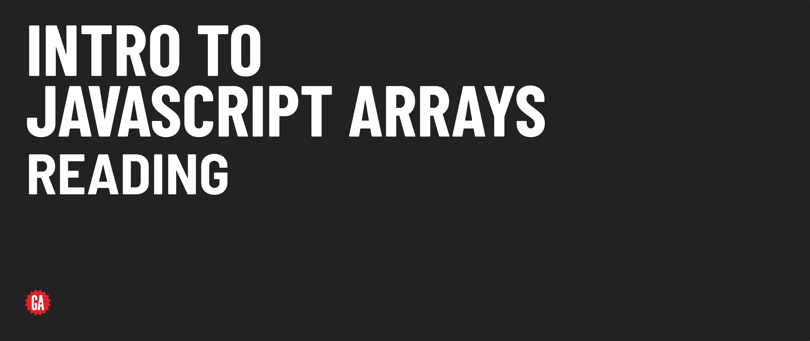

# Intro to JS Arrays - Reading 



**Learning objective:** By the end of this lesson, students will be able to access data at any location in an array.

## Accessing elements at any position in an array

Array elements are accessed using square bracket notation along with the element's __index__ (position) within the array.

```js
const movies = ['Barbie', 'Interstellar', 'Get Out'];

const firstMovie = movies[0];
// firstMovie is 'Barbie'
```

Note that indexes are integers where `0` is used to access the first element. Each consecutive element has its index incremented by one.

> 📚 An *index* is a numerical value that represents the position of an element within an array.

> 🧠 Remember that array indexes start from 0 for the first element. This "zero-based" indexing convention is used in programming to align with memory offset principles.

## Accessing the last element of an array

You can use a couple of techniques to access the last element in an array - the classic `length` property, or one of the more recent additions to JavaScript - the `at()` method.

### The `length` property

To access the last element of an array, you can utilize the [`length`](https://developer.mozilla.org/en-US/docs/Web/JavaScript/Reference/Global_Objects/Array/length) property.

```js
const lastMovie = movies[movies.length - 1];
// lastMovie is 'Get Out'
```

Unlike other programming languages, JavaScript does not support negative indexing using this method. Attempting to access an array element with a negative index will result in a value of `undefined`.

```js
movies[-1];  // undefined
```

> ❓ Assuming the below code, what will the value of the variable `color` be?
>
> ```js
> const colors = ['red', 'green', 'blue'];
> let color = colors[1];
> ```

> 🚀 Check out the [`at()` Level Up](../level-up/at.md) if you're curious about accessing the last element of an array in a more concise way!
